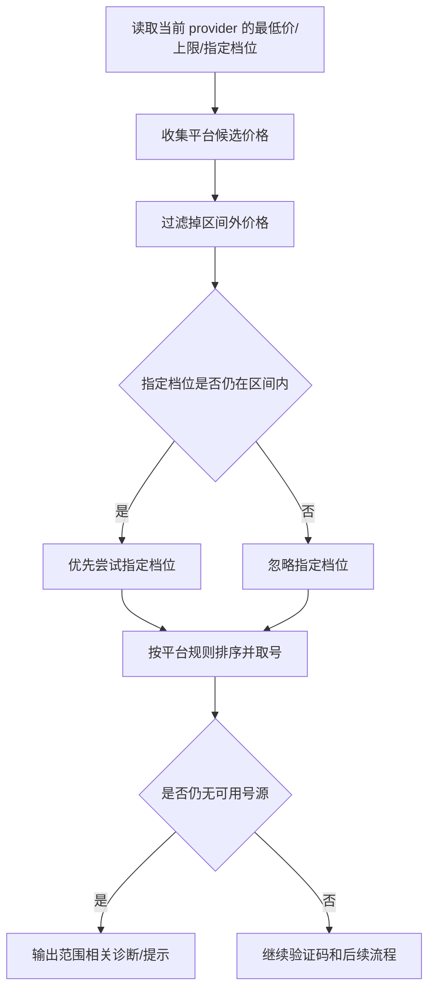

# 手机接码价格区间与最低购买价开发方案

## 1. 需求结论

本次需求不是把“价格上限”改成一个可解析字符串，而是要在现有接码价格逻辑上新增一个独立的最低购买价边界，让用户能配置：

- 只设上限
- 只设下限
- 上下限都设
- 仍然保留“指定档位”作为独立偏好

最终结论：

1. 不建议把上限文本框直接改成“范围字符串”。
2. 建议在当前价格控制区内新增一个独立的“最低购买价”输入。
3. 价格区间采用**闭区间**语义，两个边界都可空。
4. `指定档位` 不并入区间字段，只在区间内才生效。
5. 现有的内部换档下限 `countryPriceFloorByCountryId` 继续保留，不和用户可配最低价混用。

## 2. 需求符合性分析

### 2.1 符合的部分

- 低价号过滤是明确业务诉求，和当前“只看上限”确实不匹配。
- 用户希望继续保留指定档位，说明这是“筛选 + 偏好”组合，而不是单纯范围匹配。
- 当前价格控制区本来就集中在同一块，适合扩展为区间控制，不需要拆散到别的区域。

### 2.2 不足和潜在冲突

1. **直接复用上限做范围解析不稳**
   - 会把“上限”语义和“范围”语义混在一起。
   - 还会让 `指定档位` 的优先级变得不清楚。

2. **最低价不能复用 `heroSmsPreferredPrice`**
   - `heroSmsPreferredPrice` 是“指定档位”，不是下限。
   - 两者语义完全不同，混用会造成维护和排障困难。

3. **用户最低价和内部换档下限不是同一层**
   - `countryPriceFloorByCountryId` 是 Step 9 内部避让逻辑。
   - 用户最低购买价是配置项。
   - 两者必须分开，否则会互相污染。

4. **区间反转是边界问题**
   - 如果最低价大于上限，逻辑上是无效区间。
   - 这个状态必须显式处理，不能默默当成正常配置。

5. **区间和指定档位的关系要明确**
   - 指定档位只有在区间内才应参与排序。
   - 超出区间的指定档位应忽略，不应反向突破边界。

## 3. 设计方案

### 3.1 字段模型

建议保留现有字段结构，只新增最低价字段：

- `heroSmsMinPrice`
- `heroSmsMaxPrice`
- `heroSmsPreferredPrice`
- `fiveSimMinPrice`
- `fiveSimMaxPrice`

其中：

- `heroSmsMinPrice` 兼容 HeroSMS / NexSMS
- `fiveSimMinPrice` 仅服务 5sim
- `heroSmsPreferredPrice` 保持原语义，不改名

### 3.2 UI 位置

价格区仍放在当前 `row-hero-sms-max-price` 这一块里，不另起炉灶。

建议布局为：

- `最低购买价`
- `价格上限`
- `指定档位`
- `号码复用`

这样用户一眼就能看出这四项是一组策略，不会散到别的位置。

### 3.3 逻辑规则

1. 先按价格区间过滤候选。
2. 再应用指定档位排序。
3. 再按平台自身规则进行换档、重试、兜底。
4. 当区间内没有可用价格时，显示“无可用号源”类提示，而不是继续尝试区间外价格。

### 3.4 取号语义

建议统一成如下顺序：

## 4. 开发清单

### 阶段 1：字段与持久化

目标：

- 新增最低价字段默认值
- 新增归一化逻辑
- 新增保存/回显/导入兼容
- 不破坏旧配置

自检项：

- 保存后能否正确回显
- 旧配置导入后是否保持可用
- 新旧字段是否存在命名冲突
- 是否有乱码或字段缺失

### 阶段 2：UI 改造

目标：

- 在现有价格区内新增最低购买价输入
- 调整文案为“价格区间”
- 保持控件布局整齐，不把新输入塞到别的区域

自检项：

- 侧边栏宽度下是否挤压、换行错乱
- 输入框宽度是否足够
- 切换 provider 时回显是否正确
- 文案是否统一、无错别字、无乱码

### 阶段 3：取号与预览逻辑

目标：

- HeroSMS / NexSMS / 5sim 都按区间过滤候选
- 指定档位仅在区间内生效
- 预览文案同步展示区间后的结果
- 无号源提示能反映“区间过窄/区间反转/无可用档位”

自检项：

- 只设上限是否仍与现有行为一致
- 只设下限是否能正常过滤低价
- 上下限同时设置是否只保留区间内候选
- 指定档位超出区间时是否被正确忽略
- 与 `countryPriceFloorByCountryId` 是否仍然隔离

### 阶段 4：测试与全量复审

目标：

- 补齐单测
- 回归 sidepanel、background、preview、保存/切换
- 全量检查无遗漏后再提交

自检项：

- 运行测试是否通过
- 新增字段是否所有路径都覆盖
- 是否还有未同步的文案/默认值/回显逻辑
- 是否存在边界问题或乱码

## 5. 完成标准

本需求只有在以下条件同时满足时才算完成：

1. 新的最低购买价能正确保存、回显、切换、导入。
2. 价格区间在 HeroSMS / NexSMS / 5sim 的候选过滤中生效。
3. 指定档位不会突破区间边界。
4. 预览与无号源提示和真实取号逻辑一致。
5. 代码、测试、文案、注释都没有乱码和明显冲突。
6. 全量复审通过后再写中文提交信息并提交。

