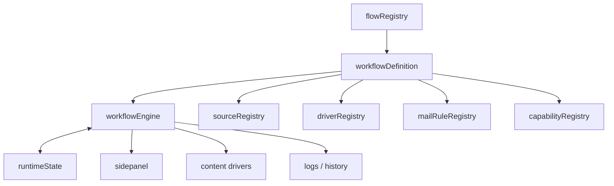

# 步骤与Flow节点化重构开发方案

## 1. 文档目标

本文不是给现有 `step` 体系再补一层适配，而是把整个执行系统升级成 **flow + node** 体系。目标是从根上解决“数字步骤硬编码”和“key 绑定混用”这两套逻辑并存的问题。

最终设计必须满足：

1. 新增步骤时，只改当前 flow 的定义和节点执行器，不再牵动全局 switch。
2. 新增完全不同的 flow 时，可以拥有完全不同的节点图、页面源、邮件规则、恢复策略和 UI 表达。
3. 最终版本不保留 `currentStep` / `stepStatuses` 作为核心状态，不保留 `STEP_*` 作为核心协议，不再让数字步骤充当身份、顺序、状态、历史和消息路由的共同主键。
4. 方案必须同时覆盖 background、content、sidepanel、日志、历史、自动运行、来源注册、邮件规则、手机号接码、Plus 支付这些强关联模块。

## 2. 重构前实现的真实形态

当前项目不是纯硬编码，而是“**定义层部分动态化，控制层仍然硬编码**”。

| 层 | 现状 | 主要问题 |
| --- | --- | --- |
| 状态 | `background.js` 里仍有 `currentStep`、`stepStatuses` | 数字步骤同时承担状态、顺序和恢复锚点 |
| 协议 | `EXECUTE_STEP`、`STEP_COMPLETE`、`STEP_ERROR`、`SKIP_STEP` | 消息协议仍以数字 step 为核心 |
| 定义 | `data/step-definitions.js`、`background/steps/registry.js` | 只有 OpenAI 真正注册，且执行仍按数字 id |
| UI | `sidepanel/sidepanel.js` 按 step 渲染、发送、跳过 | 侧边栏本质上还是数字步骤面板 |
| 内容脚本 | `content/signup-page.js` 按 `message.step` 分支 | 页面驱动逻辑被 step number 绑死 |
| 运行态 | `background/runtime-state.js` 已有 `currentNodeId`、`nodeStatuses` | 但仍通过 legacy step 视图回写，双模型并存 |
| 外围能力 | `shared/source-registry.js`、`shared/flow-capabilities.js`、`background/mail-rule-registry.js` | 已有抽象，但都还没成为唯一事实来源 |

重点文件里最能说明问题的几个点：

- `background.js`：`DEFAULT_STATE`、`setStepStatus()`、`skipStep()`、`runAutoSequenceFromStep()`、`getStepRegistryForState()` 仍把数字 step 当主流程。
- `background/message-router.js`：`STEP_COMPLETE` / `STEP_ERROR` / `EXECUTE_STEP` / `SKIP_STEP` 还在消息层面锁死 step。
- `background/runtime-state.js`：已经有 node 相关字段，但还在做 step 兼容派生。
- `sidepanel/sidepanel.js`：步骤列表、状态展示、手动执行、跳过、自动运行都还围着 step。
- `flows/openai/mail-rules.js`、`background/mail-rule-registry.js`：已经说明“规则可以 flow 化”，但目前只有 OpenAI 在用。

## 3. 为什么现在的设计有问题

### 3.1 混用了三种身份

现在一个“步骤”同时在扮演：

- 执行身份
- 顺序编号
- 状态键
- 日志标签
- 历史记录字段
- 自动运行恢复锚点

这就是后面维护越来越难的根因。只要新增一个节点，往往要同时改定义、状态、消息、UI、日志、历史、恢复逻辑，甚至测试。

### 3.2 只改 key 不够

项目里已经有 `key`，但它并没有真正替代数字 step。

当前状态是：

- `id` 负责顺序和执行
- `key` 负责局部标识
- `currentStep` 负责运行态
- `stepStatuses` 负责状态

这不是“灵活”，这是“双主键混用”。如果只把 `step` 改名成 `node`，不重做控制面，问题不会消失。

### 3.3 不能表达完全不同的 flow

现在 `getStepRegistryForState()` 直接在 `activeFlowId !== openai` 时拒绝执行，这意味着：

- 新 flow 不是“可扩展”，而是“被排除”
- 每个 flow 都只能往 OpenAI 这套结构里塞
- 只要一个 flow 的步骤顺序、页面、邮件、恢复策略不同，就会触发大量全局改动

### 3.4 线性 step 模型太弱

现有逻辑默认所有流程都是线性的 1, 2, 3, 4...。

但真实场景里，新的 flow 很可能是：

- 有分支
- 有可选节点
- 有重试回路
- 有条件跳转
- 有完全不同的外部页面驱动

这种场景下，数字 step 不是天然模型，只是临时排布方式。

### 3.5 相关模块已经开始“各自发明一套”

`runtime-state`、`source-registry`、`flow-capabilities`、`mail-rule-registry`、`navigation-utils` 都已经在做分层，但它们没有统一到一个真正的 workflow 主模型里。

结果就是：局部已经像架构，整体仍像拼接。

## 4. 目标架构



### 4.1 核心标识

| 标识 | 含义 | 规则 |
| --- | --- | --- |
| `flowId` | 业务 flow 身份 | 例如 `openai`、`site-a` |
| `runId` | 一次执行实例 | 同一轮运行内保持不变 |
| `nodeId` | 节点身份 | 唯一、稳定、可读 |
| `sourceId` | 页面来源身份 | 负责标签页、页面家族和注入目标 |
| `driverId` | 内容驱动身份 | 负责某个 source 的命令集 |

### 4.2 目标状态模型

```js
runtimeState = {
  flowId: 'openai',
  runId: 'run_20260515_xxx',
  workflowVersion: 1,
  currentNodeId: 'submit-signup-email',
  nodeStatuses: {
    'open-chatgpt': 'completed',
    'submit-signup-email': 'running',
  },
  nodeResults: {
    'open-chatgpt': { completedAt: 1710000000000 },
  },
  shared: {},
  services: {},
  flows: {
    openai: {},
  },
  runSummary: {
    finalStatus: 'running',
    failedNodeId: '',
    failureReasonCode: '',
  },
}
```

### 4.3 节点模型

```js
node = {
  id: 'submit-signup-email',
  title: '注册并输入邮箱',
  type: 'task',
  order: 20, // 仅用于展示，不参与身份
  sourceId: 'openai-auth',
  driverId: 'content/signup-page',
  next: ['fill-password'],
  retryPolicy: { maxAttempts: 3 },
  recoveryPolicy: { onFailure: 'restart-node' },
  ui: { section: 'registration' },
}
```

要点：

- `id` 是唯一主键。
- `order` 只是展示顺序，不再决定执行逻辑。
- `next` / `recoveryPolicy` 决定流转，不靠全局 step 数组推断。
- 节点结果、失败原因、重试记录要单独存，不要塞进状态字符串后缀里。

### 4.4 Flow 定义必须是一手真相

`flowDefinition` 应该统一拥有：

- 节点图
- 节点执行器引用
- source 绑定
- driver 绑定
- 邮件规则引用
- capability 定义
- recovery policy
- settings schema

其他 registry 如果存在，只能是这个定义的运行索引或编译产物，不能自己再维护一份同义信息。

## 5. 新增步骤 / 新增 flow 的接入规则

### 5.1 如果是在同一个 flow 里新增步骤

应该只做这些事：

1. 在该 flow 的 `workflowDefinition` 里新增 node。
2. 给这个 node 配置 `next`、`retryPolicy`、`recoveryPolicy`、`sourceId`、`driverId`。
3. 如果它访问了新页面、新邮件规则、新服务，再补对应的 source / driver / mail rule。
4. UI 从 flow 定义里自动拿到节点标题、顺序和状态展示。
5. 增加对应测试，不再改全局 step switch。

### 5.2 如果是新加一个完全不同的 flow

应该直接新增一个独立 flow 目录和定义，不去改 OpenAI 的步骤树：

```txt
flows/<flowId>/
  workflow.js
  sources.js
  mail-rules.js
  capabilities.js
  recovery.js
```

新 flow 的要求是：

- 可以没有手机号接码
- 可以没有 Plus
- 可以没有邮件验证码
- 可以有完全不同的节点顺序和分支
- 可以有自己的页面源和 driver

核心 engine 不改，改的是 flow 自己。

## 6. 相关模块边界

### 6.1 background

`background.js` 和 `background/message-router.js` 的职责应退回成“调度和校验”，不再自己写业务步骤树。

### 6.2 sidepanel

`sidepanel/sidepanel.js` 只能根据 flow definition 和 capability 结果渲染，不应该再手写 step 编号和 step 顺序判断。

### 6.3 content scripts

`content/signup-page.js` 这类脚本要从“按 step 分支”改成“按 node action / command 分支”。

### 6.4 source / driver

`shared/source-registry.js` 只负责页面来源、标签页生命周期和注入范围。

`driverRegistry` 只负责“这个 source 能接什么命令”。

### 6.5 mail rules

邮件过滤和验证码提取必须是 flow-local 的。`flows/openai/mail-rules.js` 说明这件事已经存在，只是还没推广成整体原则。

### 6.6 auto-run / history / logs

自动运行、日志和历史必须记录 `flowId`、`runId`、`nodeId`，而不是继续写 `step7_failed` 这种混合字符串。

### 6.7 手机接码、Plus、OAuth

这些都不是“通用步骤”，它们是 OpenAI flow 的私有能力。没有第二个 flow 的真实需求时，不要把它们硬抽成全局共享步骤。

## 7. 设计符合性检查

| 检查项 | 是否满足 | 说明 |
| --- | --- | --- |
| 不做旧兼容 | 是 | 最终状态不保留 step 作为核心模型 |
| 新增步骤可维护 | 是 | 只改当前 flow 的 node 和相关依赖 |
| 新增不同 flow 可维护 | 是 | 独立 flow 定义，不污染 OpenAI |
| 规范一致 | 是 | 统一使用 `flowId` / `runId` / `nodeId` / `sourceId` |
| 完整性 | 是 | 覆盖状态、协议、UI、日志、历史、自动运行、来源、邮件 |
| 正确性 | 基本满足 | 仍需靠分阶段测试验证边界和恢复路径 |

## 8. 方案自身的缺陷与控制点

这份方案本身也有潜在问题，必须提前说明：

1. **抽象过头风险**
   如果 flow / node / source / driver / mail rule 各自独立维护同一份信息，会重新制造同步成本。控制方式是：`flowDefinition` 必须是一手真相，其它 registry 只能是派生索引。

2. **DSL 复杂度风险**
   如果节点模型一开始就塞太多字段，后续会变成另一种难维护的配置语言。控制方式是：先保留 `id`、`title`、`type`、`order`、`sourceId`、`driverId`、`next`、`retryPolicy`、`recoveryPolicy`，其余按真实需求再加。

3. **日志和历史膨胀风险**
   如果把每个节点的所有中间态都原样落盘，历史会很重。控制方式是：日志保留可读摘要，历史保留最终结果 + 关键节点轨迹 + 失败原因码。

4. **UI 复杂度风险**
   如果 UI 同时展示 flow、node、source、driver、恢复策略，侧边栏会太吵。控制方式是：UI 只展示用户关心的流转和状态，详细调试信息留给开发记录。

5. **边界冲突风险**
   现在已经存在 `sourceRegistry`、`flowCapabilities`、`mailRuleRegistry`、`runtimeState` 等分层。如果不统一为一套 flow contract，就会继续出现“看起来都对，合起来互相打架”的问题。

## 9. 开发清单

| 阶段 | 开发目标 | 阶段自检 |
| --- | --- | --- |
| 1 | 定义最终 schema：`flowId`、`runId`、`nodeId`、`sourceId`、`driverId`、`workflowVersion` | 检查是否还在把 `currentStep` / `stepStatuses` 当核心概念使用 |
| 2 | 建立 flow definition 和 workflow engine | 检查一个 flow 是否能只靠自己的定义被加载，不改全局 switch |
| 3 | 替换消息协议 | 检查是否全面切换到 `EXECUTE_NODE` / `NODE_COMPLETE` / `NODE_ERROR` / `SKIP_NODE` 这类命名 |
| 4 | 改写 runtime / auto-run / recovery | 检查恢复、重试、跳过、暂停是否都基于 `nodeId` 和 `runId` |
| 5 | 重写 sidepanel | 检查 UI 是否完全从 flow definition 取数据，不再硬编码 step 顺序 |
| 6 | 迁移 content drivers、邮件规则、来源注册 | 检查新 flow 是否可以拥有完全不同的页面源和邮件规则，而不碰 OpenAI 核心流程 |
| 7 | 重写日志、历史、账号记录 | 检查是否只记录 `flowId` / `runId` / `nodeId`，不再产出 `stepX_failed` 这类混合状态 |
| 8 | 删除旧 step 路径和残留逻辑 | 检查仓库中核心路径是否还残留 `EXECUTE_STEP`、`STEP_COMPLETE`、`STEP_ERROR`、`currentStep`、`stepStatuses` |

### 每阶段统一自检

每做完一个阶段，都要执行下面的自检：

1. grep 核心代码，确认没有新的 step 硬编码回流。
2. 用至少一个 flow 做完整跑通验证。
3. 用一个“结构完全不同”的 flow 做边界验证。
4. 检查消息、日志、历史、UI、文档是否一致。
5. 打开 Markdown 预览，确认中文标题、表格和代码块都没有乱码。

## 10. 最终验收标准

这次重构只有在满足下面条件时才算完成：

- 核心状态不再依赖数字 step。
- 新步骤只改本 flow，不改全局控制面。
- 新 flow 可以和 OpenAI 完全不同。
- background、sidepanel、content、auto-run、logs、history、mail rules、source registry 都在同一套 flow/node 规则下运行。
- 文档、代码、测试三者描述一致，没有“代码一套、文档一套、UI 一套”的分裂。
- Markdown 和中文显示无乱码。

结论很直接：这块不能继续修补式演进，必须用 node-based workflow engine 一次性替换掉 step-number 作为核心模型的设计。

## 11. 本次落地后的实现约束

本次重构后，核心运行路径已经按下面规则收敛：

1. background、content、sidepanel 的消息协议只使用 `EXECUTE_NODE`、`NODE_COMPLETE`、`NODE_ERROR`、`SKIP_NODE`。
2. 核心运行状态只使用 `flowId`、`runId`、`currentNodeId`、`nodeStatuses`。
3. 账号运行历史的新记录使用 `flowId`、`runId`、`failedNodeId`，失败/停止状态使用 `node:<nodeId>:failed`、`node:<nodeId>:stopped`。
4. sidepanel 渲染仍可以展示“第几项”的用户文案，但状态合并、按钮执行、跳过、恢复都以 `nodeId` 为主键。
5. 邮件规则、source registry、driver command 已跟 node 对齐；验证码节点通过 `mailRuleId` 绑定，而不是通过固定步骤号绑定。
6. 自动运行主循环使用 `runAutoSequenceFromNodeGraph(startNodeId)` 按当前 workflow 的 node 列表推进，不再通过数字序号、`step++` 或 `runAutoSequenceFromNodeOrder` 驱动。
7. 自动运行恢复、idle 重开、Plus/GPC/GoPay checkout 重建都以目标 `nodeId` 和实际前置节点为锚点；遇到稀疏节点图时不会再依赖不存在的虚拟数字步骤。

阶段 8 自检命令要求核心生产路径不得再命中旧协议和旧状态字段：

```powershell
rg -n "EXECUTE_STEP|STEP_COMPLETE|STEP_ERROR|SKIP_STEP|STEP_STATUS_CHANGED" background.js background content sidepanel shared flows data
rg -n "currentStep|stepStatuses|setStepStatus|runAutoSequenceFromStep" background.js background sidepanel content shared flows data
rg -n "step\d+_failed|step\d+_stopped|step2_stopped|step7_stopped|step8_failed|step9_failed|step10_failed" background.js background
rg -n "runAutoSequenceFromNodeOrder|currentStartStep|startNodeOrder|while \(step <=|step \+= 1" background.js background
```

## 12. 后续新增节点的标准入口

同一 flow 新增节点时，按这个顺序开发：

1. 在 `data/step-definitions.js` 的当前 flow 定义里新增 node，并补齐 `nodeId`、`title`、`sourceId`、`driverId`、`command`、`mailRuleId`、`next`。
2. 在 `background/steps/` 增加或复用节点执行器，并在 registry 构建处按 `executeKey` 注册。
3. 如果节点需要页面执行，给对应 content driver 增加 `EXECUTE_NODE` command handler。
4. 如果节点需要邮件验证码，在 `flows/<flowId>/mail-rules.js` 增加 flow-local rule，并通过 `mailRuleId` 绑定。
5. 增加 node-first 测试，断言消息、状态、历史、UI 都只使用 `nodeId`。

## 13. 后续新增完全不同 flow 的标准入口

新增完全不同 flow 时，不要改 OpenAI 的节点树来“塞进去”，而是新增 flow-local 定义：

```txt
flows/<flowId>/
  workflow.js
  sources.js
  mail-rules.js
  capabilities.js
  recovery.js
```

落地前必须自检：

- 新 flow 是否可以不包含 OpenAI 私有节点，例如 Plus、手机号接码、OAuth。
- `sourceId` / `driverId` 是否只服务当前 flow，不污染全局。
- 邮件规则是否只从当前 flow definition 派生。
- sidepanel 是否能仅通过 workflow nodes 渲染，不新增全局步骤 switch。
- 自动运行、历史和日志是否都能用 `flowId/runId/nodeId` 定位。
